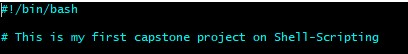
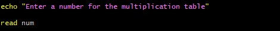
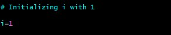
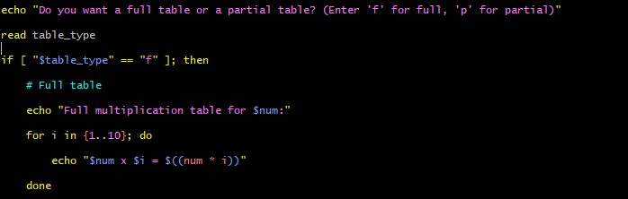
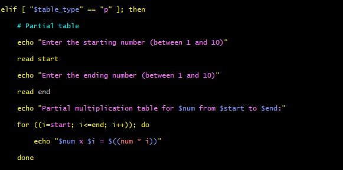
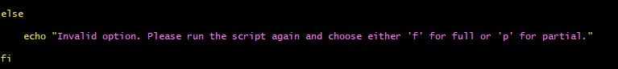

# Introduction to Shell Scripting Project

# Capstone Project-Linux Shell Scripting

## Bash Script For Generating a Multiplication Table

## Project Requirements

**User Input for Number:** The script must first ask the user to input a number for which the multiplication table will be generated.

**Choice of Table Range:** Next, ask the user if they want a full multiplication table (1 to 10) or a partial table. If they choose partial, prompt them for the start and end of the range.

**Use of Loops:** Implement the logic to generate the multiplication table using loops. You may use either the list form or C-style for loop based on what's appropriate.

**Conditional Logic:** Use if-else statements to handle the logic based on the user's choices (full vs. partial table and valid range input).

**Input Validation:** Ensure that the user enters valid numbers for the multiplication table and the specified range. Provide feedback for invalid inputs and default to a full table if the range is incorrect.
**
Readable Output:** Display the multiplication table in a clear and readable format, adhering to the user's choice of range.

**Comments and Code Quality:** Your script should be well-commented, explaining the purpose of different sections and any important variables or logic used. Ensure the code is neatly formatted for easy readability.

# Shebang and Statement

# Input from the user

# Variable: Initializing i with 1

# Asking if the user wants a full or partial table

This is where you get to give the user an option of choosing either a full multiplication table or a partial multiplication table.

## Example of a full multiplication table for user's input

## Example of a partial multiplication table for user's input

## This is the last part of the script.

just in case the user inputed a wrong or invalid option in a any of the requisition aspect, the user will be directed or instructed to run the script again and choose from the available options.

As it is shown below.

